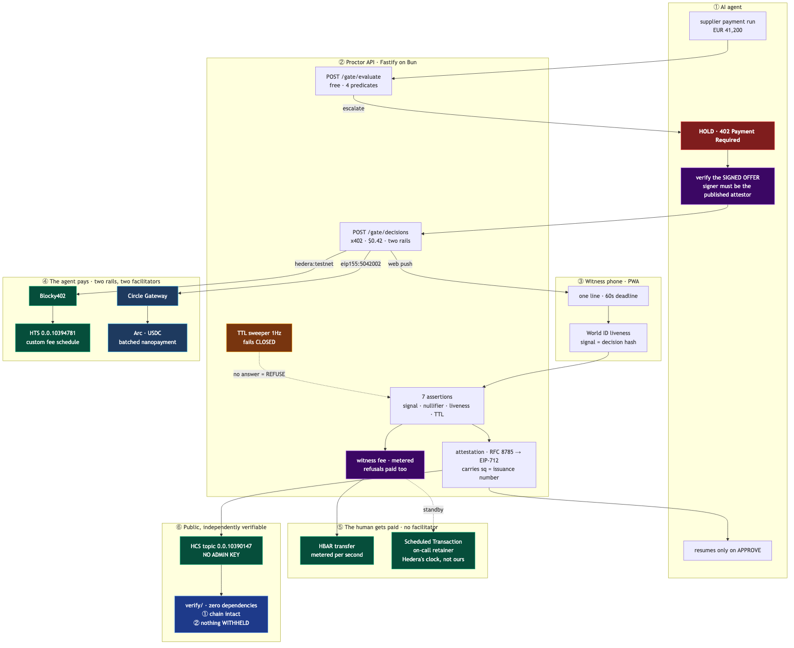

<div align="center">

# PROCTOR

**An AI agent stops mid-payment and pays a live, verified human for permission to continue.**

<br />


<br />

An AI agent hits a policy threshold and is stopped by an HTTP 402. It pays $0.42 in USDC on Hedera to open a decision. A human witness who is **not the operator** proves liveness with World ID, bound to the hash of that exact decision, and approves or refuses inside 60 seconds. The default is refuse. An attestation binding the decision hash, the liveness proof, the witness nullifier and a consensus timestamp lands on a Hedera Consensus Service topic **with no admin key**.

**The product is the evidence, not the approval.**

Built for **ETHOnline 2026**. Partners: **Hedera** (AI & Agentic Payments, Improve the Harness), **World** (Selfie Check), **Arc** (Best Agentic Economy with Circle Agent Stack).

</div>

---

## The problem, the solution, the stack

### The problem

Every AI agent framework already ships a human-approval interrupt. LangGraph has `interrupt`, Temporal has signals, OpenAI has `needsApproval`. They are free, already integrated, and they all produce the same artefact:

```
approved_by: user_44, 14:22:07
```

That row is written by the system being audited. It is editable by the party being audited. And it contains **no evidence that a human, rather than the agent's own service account, produced it**.

Since **2 August 2026**, the EU AI Act's obligations bind deployed high-risk systems. Article 12(3)(d) requires *"the identification of the natural persons involved in the verification of the results"*, and Article 14(4) requires that such systems be *"effectively overseen by natural persons"* who can *"interrupt the system"*. Both bind every high-risk deployer.

Article 14(5) goes further and requires *"at least **two natural persons**"* — but read its opening clause: *"For high-risk AI systems referred to in point 1(a) of Annex III"*, which is **remote biometric identification**. A supplier-payment agent is not that, so 14(5) does not bind this example deployer. We build to it anyway, because it is the strictest oversight bar the Act names and the evidence is identical either way. [The scope is set out in full here.](docs/regulatory-mapping.md)

A self-written, self-editable log satisfies neither.

### The solution

Proctor binds four things a self-hosted approve button cannot:

1. **The decision hash** — the witness's liveness proof is cryptographically bound to *this* decision via the World `signal`, not to "a human approved something at some point"
2. **A liveness proof issued by a party that is not the deployer** — World ID
3. **A nullifier proving the approver is not the operator** — two distinct accounts, checkable by a third party rather than asserted
4. **A consensus timestamp on a log with no admin key** — a clock the deployer did not choose, on a record nobody can rewrite, **including us**

Any third party verifies the whole record offline, against Hedera's mirror node and World's own verifier, **without trusting Proctor**.

### Why this stack

- **Hedera Consensus Service** gives an ordered, tamper-evident log at a fixed sub-cent fee, independently re-derivable through the running hash chain. A contract write costs more, has no better timestamp, and gives up the chain property.
- **x402** lets an agent pay for a resource mid-request, over HTTP, with no account and no prior relationship. The gate is a paywall the agent hits, not an integration it planned for.
- **World ID** proves liveness in seconds on a phone the witness already owns, which is the only reason a human oversight step can be measured in seconds instead of minutes. Selfie Check is the credential we designed for, and World granted the beta flag on 2026-09-09 for the duration of the event, so it is what runs. Exactly what has and has not been demonstrated end to end is [stated below](#what-is-real-vs-staged).
- **Circle** makes a sub-dollar payment to a human economically possible at all.

---

## Try it in 60 seconds

No wallet, no API keys, no feature flags. This runs the entire oversight loop:

```bash
cd backend
cp .env.example .env          # DATABASE_URL is the only value you must edit
bun install
bun run db:push
bun run seed && bun run demo
bun run doctor                # what is live, and what each gap costs you
bun run acceptance            # exercise every claim against the running service
```

**Unconfigured, this runs the full loop and produces a record that is deliberately
NOT independently verifiable** — it is signed with a published demo key and never
reaches a topic. `bun run demo` says so in its own closing line, and `bun run doctor`
lists exactly what is missing. The difference between "it ran" and "it produced
evidence" is the entire product, so the tooling refuses to blur it.

```
1. agent proposes: EUR 41200.00 -> Meridian Logistics
2. policy        : ESCALATE (amount_threshold)
3. decision      : cmtmkf18b0000lxw8lqurjc31
   human line    : Release EUR 41,200 to Meridian Logistics?
   signal        : 0x5b068ce449934ca1df15f5f4…
4. dispatched to the rota, 60s deadline running
5. proof         : VERIFIED
   signal matched this decision, and the witness is not the operator
6. APPROVED in 28 ms
7. attestation   : 722 bytes, ind=crypto
   signed by     : 0xB73837E8C34E2897debeAca0898Da23B52a6Eb10

   The agent is released. The evidence is independently verifiable.
```

And the outcome an auditor actually cares about:

```bash
bun run demo refuse
```

```
5. witness REFUSED. No proof required: refuse is the default outcome.
6. attestation   : 628 bytes, wid=null, wa=token

   The agent is NOT released.
```

### Verify our live evidence log, without installing anything

```bash
bun verify/bin/verify.ts --topic 0.0.10390147
```

```
PASS  25 messages, chain intact from genesis.
      No message was inserted, removed, reordered, or altered.

PASS  completeness: issuance numbers dense across 1 issuer(s).
      No decision was withheld from this log.
```

**Two checks, two different claims.** The first proves nothing was altered. The second
proves nothing was *withheld* — an operator who never submits a record breaks no hash.

**Zero dependencies.** `node:crypto` only. It contacts Hedera's public mirror node and nothing of ours.

---

## Verify it yourself in two minutes

Every row is a link to a file range or a public explorer. Nothing here asks you to take our word.

| Claim | Verify here |
|---|---|
| Evidence topic exists with **no admin key** | [HashScan `0.0.10390147`](https://hashscan.io/testnet/topic/0.0.10390147) |
| The running hash chain verifies offline, from genesis | `bun verify/bin/verify.ts --topic 0.0.10390147` |
| …and the implementation is dependency-free | [`verify/package.json`](verify/package.json) — empty `dependencies` |
| The Java-framing footgun is real, not folklore | [`verify/src/runningHash.ts:56-62`](verify/src/runningHash.ts) + the failing-naive test in [`verify/test/runningHash.test.ts`](verify/test/runningHash.test.ts) |
| Tampering is detected, naming the sequence number | [`docs/hashscan-links.md`](docs/hashscan-links.md) |
| The gate settles through **Blocky402** | `extra.feePayer: 0.0.7162784` in the live 402, [`docs/hashscan-links.md`](docs/hashscan-links.md) |
| The boot preflight stops a dead facilitator taking Hedera down | [`backend/src/lib/x402/server.ts:63`](backend/src/lib/x402/server.ts) |
| A proof for another decision is rejected | [`backend/src/lib/world/verify.ts:104`](backend/src/lib/world/verify.ts) |
| The operator cannot approve their own agent | [`backend/src/lib/world/verify.ts:123`](backend/src/lib/world/verify.ts) |
| Second 61 is a hard refuse, arbitrated by Postgres | [`backend/src/lib/decision/lifecycle.ts:114`](backend/src/lib/decision/lifecycle.ts) |
| Canonicalisation is RFC 8785, recursive at every depth | [`backend/src/lib/attestation/canonical.ts:37`](backend/src/lib/attestation/canonical.ts) |
| Independence is **derived**, never asserted | [`backend/src/lib/attestation/build.ts:179`](backend/src/lib/attestation/build.ts) |
| A decision withheld before submission is detected offline | [`verify/src/completeness.ts`](verify/src/completeness.ts) + `bun verify/bin/verify.ts --topic <id>` |
| Issuance numbers cannot be burned by a failed create | [`backend/src/lib/decision/issue.ts`](backend/src/lib/decision/issue.ts) — counter and create share one transaction |
| Test fixtures cannot reach the immutable evidence topic | `Org.attestable` defaults to **false**; orgs opt in |
| Every 402 carries an EIP-712 offer we cannot later reprice | decode the `payment-required` header |
| HCS-14 UAID matches a fixed test vector | [`backend/src/lib/attestation/uaid.ts:77`](backend/src/lib/attestation/uaid.ts) |
| The export cites the Act provisions it speaks to | [`backend/src/lib/evidence/export.ts:110`](backend/src/lib/evidence/export.ts) |

---

## Live proof

### The evidence log is on Hedera testnet

```
Topic:        0.0.10390147
Memo:         Proctor oversight evidence log
Admin key:    NONE  (immutable and undeletable, by anyone, including us)
Submit key:   ECDSA, operator-held
Creation tx:  0.0.10349667@1788684617.529727573
```

Per Hedera's documentation: *"if no adminKey is specified the topic is immutable."*

**Be honest about what the submit key does not buy.** We hold it, so we can still write a *false* entry. What HCS prevents is us **retroactively editing or deleting** what we already wrote, and it binds every entry to a timestamp we did not choose. Combined with a liveness proof and a nullifier issued by parties that are not the deployer, the composite is what a Postgres table cannot give.

### The records on it

The log grows every time anyone runs `bun run demo`, so rather than a table that
goes stale, here is how to read it yourself:

```bash
curl -s "https://testnet.mirrornode.hedera.com/api/v1/topics/0.0.10390147/messages?limit=100&order=asc" \
  | jq -r '.messages[] | .message | @base64d | fromjson
           | "\(.sq)  \(.out)  wid=\(.wid // "null")  ind=\(.ind)  wa=\(.wa)"'
```

A record from an approval, and one from a refusal:

| `sq` | `out` | `wid` | `ind` | `wa` |
|---|---|---|---|---|
| 30 | APPROVE | `8928af4e…` | crypto | proof |
| 16 | REFUSE | **null** | policy | token |

`wid: null` on a refusal is **correct, not missing**: refuse is the default outcome and
requires no proof. Requiring a liveness proof to press a stop button would put a failure
mode between a person and a brake pedal. `wa` records which of the two actually
authenticated the witness, so the record never overstates what was proven.

`sq` starts at 15 rather than 1 because this issuer wrote to an earlier topic before this
one existed. The completeness check bounds its claim to the range a log can actually speak
to, so records filed on a previous topic are never reported as withheld.

Every record is under the 1024-byte single-chunk ceiling, so each is one sequence number
and one consensus timestamp.

### Tamper detection, run against that exact topic

| Attack | Result |
|---|---|
| One bit flipped in sequence 4 | `FAIL at seq 4 (running hash mismatch)` |
| **The refusal at sequence 2 deleted** | `FAIL at seq 3 (sequence gap: expected 2, got 3)` |

The second row is the product in one line: **an inconvenient refusal cannot be quietly removed.**

### The harder question: not "was it altered" but "is it all there"

Everything above proves **integrity**. None of it proves **completeness**, and those are
different claims. An operator suppressing an inconvenient refusal does not need to forge
anything. They simply never submit it. No hash breaks, no signature fails, the chain over
what *was* submitted stays pristine, and `verify` prints PASS.

That is the honest hole in every tamper-evident log, and it is the one a deployer would
actually use.

Proctor closes it by numbering decisions densely per org at **issue** time and signing that
number into the attestation as `sq`. A withheld record becomes a hole in a sequence, and the
operator cannot renumber around it because the neighbouring numbers are already committed to
a topic with no admin key under a timestamp they did not choose.

```
PASS  25 messages, chain intact from genesis.
      No message was inserted, removed, reordered, or altered.

FAIL  completeness: 1 decision(s) never reached this log.
      missing issuance number(s): 7
      The chain is intact, so nothing was deleted. Something was never written.
```

The check runs **offline against the mirror node**, in the same zero-dependency verifier, so
the party being audited is not the one telling you their evidence is complete.

| Question | Answered by | Catches |
|---|---|---|
| Was it altered? | running hash chain | insertion, removal, reordering, edits |
| Is it all there? | dense signed issuance numbers | a decision that was never written |

**What it still does not prove, stated rather than hidden.** An operator can stop writing
entirely from some point on, and a trailing absence is indistinguishable from "nothing further
happened". Suppression in the middle is caught; abandonment is merely loud. A test asserts that
residual weakness explicitly, so nobody later "fixes" it into an overclaim.

Two details that took a live run to get right, both now tested:

- **`sq` is dense per issuer, not per topic.** Checking density across a shared topic without
  grouping invents gaps wherever two orgs interleave and reads a second org's `#1` as a
  duplicate. Both are false accusations of withholding evidence, which is worse than no check.
  We group by the operator nullifier `on`, already in every record, so it costs no bytes.
- **The range checked is `min..max`, never `1..max`.** Records written before this field
  existed carry no `sq`, and a mirror query window may not reach the first one. Starting at 1
  would report records that are merely outside the view as suppressed.

## Who uses it, and where

Four surfaces, one per role. None of them need a terminal.

| Who | Where | What they do |
|---|---|---|
| **Operator** | `/operator` | Describe an action, watch policy decide, hand it to a phone |
| **Witness** | `/w/<token>` | Approve or refuse on a phone, in under a minute |
| **Auditor** | `/console` | Read the evidence, re-verify it against Hedera without trusting us |
| **Agent developer** | `POST /v1/gate/decisions` | Integrate the gate. It is an HTTP 402, not an SDK |
| **MCP agent** | [`mcp/`](mcp) | One tool, `request_human_approval`. Claude Desktop, Cursor, anything MCP |

Full walkthrough: **[`docs/USING_PROCTOR.md`](docs/USING_PROCTOR.md)**. Where this goes next, and what we deliberately will not build: **[`docs/ROADMAP.md`](docs/ROADMAP.md)**.

The operator console is the screen that makes this a product rather than a set of
scripts, and it is honest about its one shortcut: it opens decisions **without settling a
payment**, says so in its own API response (`paid: false`), and is **off unless
`DEMO_MODE=true`**. The paid path is unchanged and unbypassed — the witness token is a
bearer credential the gate never returns to the payer, which is why `a2a.SendMessage`
also refuses with `-32601` rather than opening a decision for free.

## The payment flow

Two paid calls, both x402 v2, both settled by a facilitator rather than by us.

**1. The gate — a flat fee to interrupt a machine.**

```
POST /v1/gate/decisions                    (unpaid)
  → 402 Payment Required
    payment-required: <base64>             the challenge is a HEADER, not the body
```

The agent decodes the header, **verifies the offer we signed**, picks a rail, signs a
payment payload, and retries. The facilitator verifies and settles; we never touch the
buyer's key.

```
POST /v1/gate/decisions                    (with payment)
  → 200  { decisionId, humanLine, decisionHash, expiresAt }
```

**2. The release — priced from the seconds of human attention actually spent.**

```
POST /v1/gate/decisions/:id/release
```

Flat-rate for the interrupt, metered for the attention, and linear in review seconds. A
decision that **expired** meters to zero: nobody looked at it, so no human time is owed. An
approval or refusal always bills something, because a human did look — a floor applies,
since x402 cannot quote a zero amount and a free release would be free oversight.

**Where each leg settles**

| Leg | Payer → payee | Rail | Finality |
|---|---|---|---|
| Gate | agent → treasury | Hedera via **Blocky402**, or Arc via **Circle Gateway** | Hedera: on chain, final. Arc: committed to a batch |
| Release | agent → treasury | same | same |
| **Witness fee** | operator → witness | **direct HBAR, no facilitator** | on chain, final |
| **Retainer** | operator → witness | **Scheduled Transaction**, Hedera's clock | fires without us |

The machine pays through infrastructure. The human is paid directly.

**The `payment-required` header, decoded from a live 402:**

```json
{
  "x402Version": 2,
  "accepts": [
    { "scheme": "exact", "network": "hedera:testnet",
      "amount": "420000", "asset": "0.0.10394781",
      "payTo": "0.0.10349677", "maxTimeoutSeconds": 180,
      "extra": { "feePayer": "0.0.7162784" } },
    { "scheme": "exact", "network": "eip155:5042002",
      "amount": "420000", "asset": "0x3600000000000000000000000000000000000000",
      "payTo": "0xB73837E8…6Eb10", "maxTimeoutSeconds": 604900,
      "extra": { "name": "GatewayWalletBatched", "verifyingContract": "0x0077777d…",
                 "minValiditySeconds": 604800 } }
  ],
  "extensions": { "offer-receipt": { … }, "payment-identifier": { … } }
}
```

Reproduce it:

```bash
curl -s -i -X POST http://localhost:3700/v1/gate/decisions \
  -H 'content-type: application/json' \
  -d '{"action":{"kind":"transfer","amount":"41200.00"}}' \
  | grep -i '^payment-required' | cut -d' ' -f2 | base64 -d | jq
```

Full artefact list, with every transaction id: [`docs/hashscan-links.md`](docs/hashscan-links.md).

### The gate settles through Blocky402

Hedera's qualification bullet names one facilitator. `extra.feePayer` is injected by the library from that facilitator's own `/supported` response, so it identifies the settling facilitator **as a fact rather than a claim**:

```json
{
  "x402Version": 2,
  "accepts": [{
    "scheme": "exact",
    "network": "hedera:testnet",
    "amount": "420000",
    "asset": "0.0.429274",
    "payTo": "0.0.10349677",
    "maxTimeoutSeconds": 180,
    "extra": { "feePayer": "0.0.7162784" }
  }]
}
```

| Field | Origin |
|---|---|
| `extra.feePayer` `0.0.7162784` | **Blocky402's** fee payer. `x402.org` would show `0.0.9185802` |
| `amount` `420000` | library converted `price: "$0.42"`; no hand-rolled decimal maths |
| `asset` `0.0.429274` | resolved by `ExactHederaScheme`. USDC on Hedera is an **HTS token**, so every settlement moves HTS |

### Accounts

| Role | Account | Type |
|---|---|---|
| Operator (writes attestations) | [`0.0.10349667`](https://hashscan.io/testnet/account/0.0.10349667) | ECDSA secp256k1 |
| Treasury (`payTo`) | [`0.0.10349677`](https://hashscan.io/testnet/account/0.0.10349677) | ECDSA secp256k1 |
| Agent (pays the gate) | [`0.0.10359475`](https://hashscan.io/testnet/account/0.0.10359475) | ECDSA secp256k1 |

### Arc testnet: ERC-8004 agent identity

| | |
|---|---|
| Agent ID | **[891434](https://testnet.arcscan.app/token/0x8004A818BFB912233c491871b3d84c89A494BD9e/instance/891434)** |
| Registry | [`0x8004A818…BD9e`](https://testnet.arcscan.app/address/0x8004A818BFB912233c491871b3d84c89A494BD9e), Circle's canonical deployment |
| Transaction | [`0xab73e419…d30ed9`](https://testnet.arcscan.app/tx/0xab73e419e168905b3e953d3e5ffd0ca79cfa398a775239bc99127daa86d30ed9) |

The agent carries the **native identifier on each chain**: HCS-14 on Hedera, ERC-8004 on
Arc. We previously declined ERC-8004 because a self-deployed registry is weaker than a
canonical one and Hedera has none. Arc ships canonical registries, so that objection does
not apply there. Both are published at `/.well-known/proctor.json`.

### Agent identity, HCS-14 (draft)

```
uaid:aid:9373hj8Dco351vuqrK3p4veDXreeN6848f5A2qQKBdQK4Azmi2BL7UB7rA3Fwiq4KU;uid=0;registry=proctor;proto=x402;nativeId=hedera:testnet:0.0.10349677
```

---

## Sponsor integration in detail

### Hedera (primary)

| Building block | What it is | How Proctor uses it | Product moment |
|---|---|---|---|
| **Hedera Consensus Service** | Ordered, tamper-evident message log with network-assigned timestamps | The evidence substrate. Every resolved decision writes one attestation under 1024 bytes, so it is one chunk with one sequence number and one consensus timestamp. [`backend/src/lib/hedera/hcs.ts`](backend/src/lib/hedera/hcs.ts) | An auditor reads a record whose timestamp the deployer did not choose |
| **Topic with no admin key** | Immutable, undeletable topic | Created once with a submit key and deliberately no admin key. Nobody can update or delete it, including us. Irreversible: the memo can never change | "We cannot delete this even if we wanted to" is checkable on HashScan |
| **Running hash chain (SHA-384)** | Each message commits to the previous hash, payer, topic, timestamp, sequence number and message digest | Recomputed offline in [`verify/src/runningHash.ts`](verify/src/runningHash.ts) to prove no message was inserted, removed, reordered or altered, **with zero trust in the mirror node** | `bun verify --topic 0.0.10390147` prints PASS, and FAIL on one edited character |
| **x402 v2, `exact` scheme** | Pay-per-request over HTTP 402 | The gate. An unpaid `POST /v1/gate/decisions` returns 402 with the requirements in a base64 `payment-required` header. [`backend/src/lib/x402/server.ts`](backend/src/lib/x402/server.ts) | The agent stops mid-run and pays, with no prior account |
| **Blocky402 facilitator** | Hedera-native x402 facilitator | The **default**, not a fallback, because Hedera's qualification bullet names it. Its fee payer appears in every 402 we issue | Provable from the wire, not from our prose |
| **HTS** | Hedera Token Service | **The gate settles in an HTS token we minted**, `0.0.10394781` (PGC, 6dp), carrying a **custom fractional fee schedule**. USDC on Hedera is also an HTS token, but Circle's faucet never delivered any, so that claim rested on an asset we had no balance of. Minting our own removed the dependency | A real HTS settlement with the custom fee visibly assessed on chain |
| **Scheduled Transactions** | Long-term schedules with `waitForExpiry` | **On-call standby pay.** Paying only per decision prices availability at zero, so a witness reachable all day who receives nothing earns nothing, and the rota decays until nobody is there. The next retainer is committed on chain and fires from **Hedera's clock**, not ours | A witness can verify their next payment exists before agreeing to be on call, without asking us |
| **HCS-14 (draft)** | Universal agent identifier | Generated per the draft spec: six canonical fields, SHA-384, Base58. No SDK dependency, because a draft standard on a pre-1.0 SDK must not break the evidence writer. [`backend/src/lib/attestation/uaid.ts`](backend/src/lib/attestation/uaid.ts) | Fixed test vector so any reader reproduces the string |
| **Mirror node** | Public read API | Confirms each attestation and supplies the raw rows the offline verifier recomputes. Postgres is the index; **HCS is the truth** | Every console row carries the sequence number needed to re-verify independently |

#### The hard part, and it is our best story

The consensus protobuf documents twelve inputs to the SHA-384 running-hash digest. **Hashing those twelve fields concatenated raw produces a hash that never matches, with no diagnostic.**

The consensus node serialises them through a Java `ObjectOutputStream`, so the bytes actually hashed include the stream header, a class descriptor for `byte[]`, block-data records around the primitives, and a back-reference for the second `byte[]`. Reproduced byte for byte in [`verify/src/runningHash.ts:56-62`](verify/src/runningHash.ts).

Verified against live testnet topic `0.0.4320226`, 45 messages from genesis:

```
mirror node says : c91842fa5e802cc4ac04cf8dd3a5f6b2
naive (doc list) : 509d029eaf6b862d2f96cfb917943f82  <- WRONG
framed (ours)    : c91842fa5e802cc4ac04cf8dd3a5f6b2  <- MATCH
```

The test suite asserts **both** directions: that the framed version reproduces consensus, and that the naive one does not. Nothing in the Hedera tooling ecosystem currently ships this.

#### The agent checks the price is signed before paying it

`wrapFetchWithPayment` answers a 402 automatically, which is convenient and also means
an agent will pay whatever it is told to pay. A seller could quote one price in its docs
and another to a machine, and nothing in the base protocol leaves the buyer an artefact
to complain with.

So the agent fetches the 402 **unpaid**, verifies the seller signed those exact terms,
and checks the recovered signer against the attestor address published at
`/.well-known/proctor.json`. Only then does it hand over money.

```
offer verified: 100000000 0.0.0 on hedera:testnet
  signed by 0xB73837E8C34E2897debeAca0898Da23B52a6Eb10, valid until 2026-09-06T09:02:56.000Z
offer verified: 420000 0x3600…0000 on eip155:5042002
  signed by 0xB73837E8C34E2897debeAca0898Da23B52a6Eb10, valid until 2026-09-13T09:01:36.000Z
```

Both rails, one signer, two validity windows — Gateway requires at least seven days,
Hedera does not. **Recovering an address always succeeds; recovering the *right* one is
the check**, and treating "did not throw" as "signature valid" is how this gets built
wrong. If the signer is not the published attestor the agent refuses to pay and says why.

A seller that has not adopted the extension is not refused: the agent says
`paying on an unsigned quote` out loud rather than pretending the check happened.

#### Both rails, settling

The agent pays on either rail, selected with `PREFER_NETWORK`:

```
=== ARC ===                              === HEDERA ===
payer      0x361c196a…3aef               payer      0.0.10359475
network    eip155:5042002                network    hedera:testnet
tx         f039ac8b-1a82-4b55-…          tx         0.0.7162784@1788752592.622448186
status     committed to a Circle         status     on chain, final
           Gateway batch
```

Gateway balance moved `2.000000 → 1.580000` USDC: exactly the $0.42 gate price.

**The two rails settle differently and the agent says so.** Hedera returns a consensus
transaction id that is final the moment it resolves. Gateway returns a **batch id** — the
payment is committed and the balance has moved, but it reaches the chain later, batched
with others. The agent originally printed a HashScan link for the Gateway batch id, which
produces a URL that can never resolve, and called it *"settled"*. Both are now
rail-aware, because "paid" and "on chain, final" are different claims.

Three things had to be true before the Arc leg would settle, and each failed in a way that
named something else:

| Missing | How it presented |
|---|---|
| `GatewayEvmScheme` registered client-side | the agent silently paid on Hedera instead |
| The Arc asset in the agent's `allowedAssets` | *"the gate advertised only hedera:testnet"* — which is not what the gate said |
| A payee **different from the payer** | a bare `402` with an empty body |

The first two are spend controls doing their job. The third is worth stating plainly: with
`PAY_TO_ARC` set to the agent's own address the agent pays itself, and Gateway rejects the
authorization with nothing that hints at why.

#### Funding the Arc rail, and the distinction that costs an afternoon

**Holding USDC in the wallet is not enough.** Gateway nanopayments spend from a *Gateway
balance* — a separate deposit held by the `GatewayWallet` contract. A wallet with plenty of
USDC and no Gateway balance fails to settle with an error that reads like a signing problem.

Two on-chain steps against Arc's own RPC, neither of which touches `circle.com`:

```
1. USDC.approve(gatewayWallet, amount)      0x3600…0000
2. gatewayWallet.deposit(usdc, amount)      0x0077777d…
```

Funded and confirmed: wallet `19.995554 → 17.992384` USDC, **Gateway balance `2.000000`**.

Two things worth knowing if you follow this path:

- **The balances API returns a decimal string** (`"2.000000"`), not atomic units. `BigInt()`
  on it throws — but an empty balance is `"0"`, which parses fine, so the bug only appears
  once money actually arrives.
- **Only the balance *check* needs `circle.com`.** The deposit is pure on-chain work. Since
  that host is intermittently TLS-intercepted here, an unreachable balance is reported as
  `UNREACHABLE` rather than `0`: *"you have no money"* and *"we could not ask"* are very
  different answers to act on, and conflating them would have blocked a deposit that was
  perfectly able to proceed.

#### The on-call retainer, and why it is a Scheduled Transaction

Paying a witness only when a decision arrives prices **availability** at zero. Someone who
keeps a phone on all day and receives nothing earns nothing, so a rota decays until nobody
is reachable — and an oversight gate whose witnesses have drifted away fails closed on
every decision, which is safe and useless. Real on-call pays standby.

It is a scheduled transaction rather than a cron job for the same reason the evidence log
is on HCS: **a cron job pays when our server chooses to; a scheduled transaction fires
whether or not we are alive, honest, or still solvent.** The witness can check their next
payment exists before agreeing to be on call.

Verified end to end on testnet, [schedule `0.0.10394981`](https://hashscan.io/testnet/schedule/0.0.10394981):

```
wait_for_expiry : true
expiration      : 1788714592.890000000
executed        : 1788714592.262342758   ← Hedera fired it, not us

witness balance : 112011420 → 112511420 tinybar   (+500000, exactly the retainer)
```

**Recurrence, stated honestly.** Hedera schedules are one-shot. Recurrence here means the
next retainer is committed when the previous one executes, so exactly one future payment is
on chain at any moment. That is weaker than a native recurring primitive, and it is
described that way rather than dressed up.

**An admin key is retained**, so a witness who leaves the rota can be removed. Without one
the schedule could never be cancelled.

**A scheduled payment fires without telling us**, so `reconcileRetainers()` reads the mirror
node and records what actually executed, using the network's timestamp rather than our
intent. Skipping that is how a database ends up saying `VERIFIED` forever while the money
has already moved — the same drift that once had our demo printing one thing and the
evidence log recording another.

#### Settling in HTS, with a custom fee schedule

Hedera's extra-points list asks for *"HTS tokens or custom fee schedules in the settlement
path."* We had neither in practice: USDC **is** an HTS token, but the faucet never
delivered, so every settlement moved HBAR and the claim rested on an asset with no balance.

The gate already quoted an arbitrary token id correctly — verified against a live 402 — so
supply was the only thing missing. So we minted one:

| | |
|---|---|
| Token | [`0.0.10394781`](https://hashscan.io/testnet/token/0.0.10394781) — Proctor Gate Credit (PGC), 6 decimals |
| Custom fee | 1/100 fractional to the treasury, `allCollectorsAreExempt` |
| `feeScheduleKey` | retained, so it is a fee **schedule** rather than a fee decision |

A real settlement, [`0.0.7162784@1788713352.579834930`](https://hashscan.io/testnet/transaction/0.0.7162784-1788713352-579834930):

```
0.0.10359475   -420000   the agent pays
0.0.10349677   +415800   the treasury receives
0.0.10349667     +4200   custom fractional fee, collected
```

```json
"assessed_custom_fees": [
  { "amount": 4200, "collector_account_id": "0.0.10349667", "token_id": "0.0.10394781" }
]
```

Both halves of the bullet, on chain, settled through Blocky402. Six decimals deliberately,
so the same `$0.42 → 420000` arithmetic holds and swapping back to USDC really is one
variable.

**The agent refused the first attempt, correctly.** Its own spend controls allow only
assets its operator has approved, so a freshly minted token was rejected until it was added
explicitly. That is the right default for software that spends money unattended, and it is
worth more than the settlement it briefly blocked.

#### Paying the witness, and why it is HBAR

| | |
|---|---|
| Asset | **HBAR**, not USDC |
| Amount | metered from real review milliseconds, floored |
| Trigger | every resolved decision, approve **and** refuse |
| Idempotency | `@@unique([decisionId, leg])` — three concurrent calls produce one payment |

**HBAR rather than USDC is a deliberate accessibility decision, not a shortcut.** A recipient
that has never held a given HTS token cannot receive it: the transfer fails on *association*,
not on balance. A witness is a person on a rota, not a crypto user, so requiring them to
associate a token before they can be paid for thirty seconds of attention puts a wallet
onboarding flow in front of a brake pedal. HBAR needs no association and auto-creates a hollow
account on first receipt.

**A refusal is paid identically to an approval.** Paying only for approvals would price the
witness to say yes, which is the exact incentive this product exists to remove. A test asserts
it.

**A witness with no payout account is recorded as owed, never silently skipped.** The fee was
earned; dropping it because onboarding is incomplete would let an org quietly consume human
attention for free.

The payout runs **off the critical path**, like the attestation. The agent is released on the
decision outcome, so a slow or failed transfer can never delay the release or change what the
evidence says happened.

#### Trade-offs we accepted for Hedera

- **HCS instead of a contract for attestations.** Rejected on-chain per-decision records because HCS is $0.0008 per message with a network-assigned timestamp and a running hash chain; a contract write costs more, has no better timestamp, and **gives up the chain property**. Trade-off: no on-chain queryability of individual records. We accept that because the export plus the mirror node covers it.
- **Zero Solidity, entirely.** Rejected `OversightLog.sol` because nothing on the critical path needs it and no prize bullet requires it. Enrolment records and trust roots go to HCS, where the consensus timestamp cannot be backdated any more than a contract event can. Trade-off: no deployed contract to point at.
- **A submit key.** Rejected an open topic because any account could then append to our evidence log and an auditor could not distinguish a genuine attestation from an attacker's. Trade-off: we hold the key, so we can write a false entry. Stated plainly above rather than hidden.
- **Blocky402 as the default facilitator.** Rejected `x402.org` as primary because the qualification bullet names Blocky402 with no "or equivalent". Trade-off: a third-party dependency with no published SLA, mitigated by the boot preflight below.

### World ID (Selfie Check)

| Component | What it is | How Proctor uses it | Product moment |
|---|---|---|---|
| **`signal` binding** | Application-supplied value hashed into the proof | **The mechanism the entire product rests on.** The decision hash is the `signal`, so a liveness proof is bound to *this* decision and cannot be replayed against another. [`backend/src/lib/world/verify.ts:104`](backend/src/lib/world/verify.ts) | Without it, any liveness proof satisfies any decision and Proctor is a paid captcha |
| **Nullifier comparison** | RP-scoped pseudonymous identifier | The witness nullifier is compared against the operator's, as bigint so hex casing cannot smuggle a match past. This is the evidence Article 14(5) asks for where it applies, and the strictest bar the Act names anywhere | The operator cannot approve their own agent |
| **RP signature (v4)** | Mandatory backend signature before the widget opens | ES256 over the RP payload, minted **per decision** rather than on page load, with a single-use nonce persisted. [`backend/src/lib/world/rp.ts`](backend/src/lib/world/rp.ts) | New in 4.0 and the single biggest schedule risk on this leg; it works |
| **Desktop QR handoff** | World's documented desktop flow: the challenge is shown on a screen and the phone scans it | `/handoff/<token>` renders a QR built from **its own origin**, so the link is correct by construction. Chosen over Web Push deliberately: push needs a service worker, a secure context, and permission granted beforehand on that exact origin — three ways for a handoff to fail *silently* in front of a camera | The witness needs nothing installed but the World ID App they were going to use anyway |
| **Selfie Check** | Medium-assurance liveness credential | Treated as an **abuse-prevention and eligibility** signal, behind one variable so the swap is a one-line change | It is what stops the approval being satisfied by the agent's own service account |

#### What we claim, and what we do not

> Proctor treats Selfie Check as an **abuse-prevention** signal, not an identity signal: it is what stops the approval step from being satisfied by the agent's own service account, which is the exact failure mode that makes today's human-oversight logs worthless to an auditor.

> **We do not claim Selfie Check proves one-person-one-account.** It proves liveness and facial continuity. Our claim is narrower and sufficient: the approver was a live human, and their World ID account is cryptographically distinct from the operator's. Independence between the two *humans* is a policy property of the rota, and every attestation records which of the two it carries in an explicit `ind` field.

| Property | Established by | Strength |
|---|---|---|
| A live human approved | Selfie Check | **cryptographic** |
| They approved **this** decision | decision hash as `signal` | **cryptographic** |
| Their account differs from the operator's | nullifier comparison | **cryptographic**, v3 credentials only |
| They are a different **person** | the rota, an org policy | **policy** |
| The record was not altered afterwards | HCS running hash, no admin key | **cryptographic** |

**Two distinct nullifiers do not prove two humans.** One person can hold two World ID accounts. `classifyIndependence` **derives** `ind` rather than asserting it, and degrades to `policy` on any credential whose nullifier is one-time-use.

#### The finding that decides our fallback

World's own docs contradict each other, and the answer changes an integrator's design:

- `idkit/integrate`: *"The same person verifying the same action always produces the same nullifier."*
- `4-0-migration`: *"In 4.0, nullifiers are one-time-use, and `session_id` is the stable link across requests."*

The migration guide is newer and version-qualified, so it is the correction. **The operator-independence check is meaningful on a World ID 3.0 credential and silently meaningless on a v4 uniqueness proof**, where two proofs from the *same* account produce different nullifiers and `witness !== operator` passes trivially.

That is why `hasStableNullifier()` exists, and why a test asserts `hasStableNullifier('ORB_PRESENCE') === false`. If we are ever forced onto the v4 path, the test suite itself records that the property degraded.

Full write-up, with nineteen dated and reproducible items across all five required sections: **[`WORLD_FEEDBACK.md`](WORLD_FEEDBACK.md)**.

#### Trade-offs we accepted for World

- **Selfie Check over `proofOfHuman`.** Rejected the v4 uniqueness path because its one-time-use nullifier makes our core security property silently false. Trade-off: Selfie Check is a gated beta, so we build behind one variable and ship the compatible preset if the flag does not arrive.
- **A refusal requires no proof.** Rejected symmetric proof requirements because making a human prove liveness to press a stop button puts a failure mode between a person and a brake pedal. Trade-off: a refusal is authenticated by bearer token alone, so every attestation carries `wa: "proof" | "token"` to say so rather than overstate.
- **Server-side verification only.** Selfie Check proofs cannot be verified on-chain on any chain, and there is no World ID deployment on Hedera at all. We attest a backend-verified **outcome** and publish the raw proof so a third party re-verifies against **World**, not against us.

### Arc / Circle

| Component | How Proctor uses it | Status |
|---|---|---|
| **Arc as a second payment rail** | Every 402 advertises `exact` on `eip155:5042002` alongside Hedera. Settled through **Circle's Gateway facilitator**, which serves Arc; USDC is the gas token and the asset, at the ERC-20 interface `0x3600…0000` | **Live on the wire** |
| **`GatewayEvmScheme`** | Not `ExactEvmScheme`. The base class drops `supportedKind.extra`, and Gateway needs `verifyingContract`, `name` and `version` to reach the buyer or they sign against the wrong EIP-712 domain and the signature fails to verify for no visible reason | Live |
| **Capability cache** | `/supported` answers are cached per facilitator. A network that intermittently intercepts `*.circle.com` can no longer silently delete the Arc rail at boot. **Capabilities only** — never `verify` or `settle`, so it can never make a payment look settled | Live |
| **Per-second meter** | The witness is billed for real seconds of human attention, streamed to the agent at 4Hz over SSE. A single $0.42 payout does not need Nanopayments; a per-second meter does | Live. A real 10s review billed $0.021275 |
| **Gateway balance** | Nanopayments spend from a Gateway deposit, not the wallet balance — a funded wallet with no Gateway balance fails with an error that reads like a signing problem | Funded, and spent from |
| **Why Paymaster is absent** | Circle Paymaster has no Arc support, and on Arc gas is already USDC, so it is structurally redundant | Stated rather than silent |

### Zero Hedera services exist in Circle's Agent Marketplace

Circle's [Agent Marketplace](https://agents.circle.com/services) is a curated catalog
where agents discover and pay for x402 services. We queried its public Discovery API,
no key required, and sampled 50 live services:

```
   49  Base        31  Solana      30  Polygon     18  Ethereum
   18  Avalanche   18  Arbitrum    18  Optimism    18  Unichain

Hedera services listed: NONE
```

Every listed service settles on an EVM chain or Solana. Reproduce it with
`cd backend && bun run marketplace`.

Our listing prerequisites are already met: a 402-returning service, a published OpenAPI
spec at `/openapi.json`, and a payout account. The remaining requirement is a public
URL, since listings are continuously health-checked. Detail in
[`docs/circle-marketplace.md`](docs/circle-marketplace.md).

#### The Arc finding we got wrong first, and how

We spent a day believing Arc was unsupported by x402, because the boot preflight kept
dropping it. It was not. **We were only ever asking Blocky402**, which serves Hedera and not
Arc, and reading "the one facilitator we asked does not serve this" as "no facilitator serves
this". Circle's own Gateway facilitator serves Arc testnet, and says so publicly:

```bash
curl -s https://gateway-api-testnet.circle.com/v1/x402/supported \
  | jq '.kinds[] | select(.network=="eip155:5042002")'
```

Two things made this hard to see, and both are now handled rather than worked around:

- **The SDK's own example points at a host that does not resolve.** `@circle-fin/x402-batching`
  documents `url: "https://gateway.circle.com"`; that domain returns a Cloudflare origin error
  and fails to resolve. The working host is `gateway-api-testnet.circle.com`, which appears in
  Circle's seller quickstart rather than in the package.
- **`*.circle.com` is intermittently TLS-intercepted**, and `initialize()` *swallows* a
  facilitator that throws. So one flaky call silently removed an entire payment rail and the
  only symptom was "no facilitator support" for a network that is fully supported. Measured at
  roughly one boot in three. `getSupported()` is now retried with backoff, and the dropped-entry
  warning says *"either genuinely unsupported, or its /supported call failed at boot"* instead of
  asserting the first.

**Arc now settles.** The Gateway balance is funded and a real payment has moved through it:
`2.000000 → 1.580000` USDC, exactly the $0.42 gate price. What remains unshipped there is
mainnet, which does not exist yet.

---

## The nine lines that save the demo

Tested with a facilitator unreachable. It does **not** degrade gracefully — it takes the **whole route down, including entries a healthy facilitator serves**, returning a bare 500 on every request.

The trap has four steps: `initialize()` swallows the dead facilitator and resolves cleanly, `paymentMiddleware()` also succeeds because it validates lazily, the real validation throws `RouteConfigurationError` **asynchronously**, and that rejection is **not caught by `app.setErrorHandler`**. Boot looks healthy. Every request fails.

```ts
await server.initialize();
const accepts = desired.filter((o) => {
  const ok = !!server.getSupportedKind(2, o.network, o.scheme);
  if (!ok) console.warn(`DROPPED accepts entry: ${o.scheme} on ${o.network}`);
  return ok;
});
if (accepts.length === 0) throw new Error('no_payment_option_available');
paymentMiddleware(app, { 'POST /v1/gate/decisions': { accepts } }, server);
```

Verified against the real scenario, not a synthetic one: asking Blocky402 for Hedera **and** Arc drops Arc and keeps Hedera payable.

```
[x402] DROPPED accepts entry: exact on eip155:5042002 (no facilitator support)
[x402] 1 payment option(s) live: hedera:testnet
```

This converts *"Circle is down so nothing works"* into *"Circle is down so the demo runs on Hedera only"*, decided automatically at boot. [`backend/src/lib/x402/server.ts:63`](backend/src/lib/x402/server.ts)

---

## Architecture



Source: [`docs/architecture.mmd`](docs/architecture.mmd) · also available as
[SVG](docs/architecture.svg). Rendered from source, so it cannot drift from what is
written down — which it had, badly: the previous version predated the Arc rail, the
witness payout, the retainer and the completeness check, showed the wrong topic and the
wrong settlement asset, and did not mention Circle anywhere.

Read it in five parts: the agent stops and **checks the offer is signed before paying**;
it settles on **either rail, through a different facilitator each**; a human on a phone
proves liveness bound to the decision hash; **the human is paid directly, with no
facilitator in the way**; and the outcome lands on a log anyone can check for both
integrity and completeness.

**Postgres is the index. HCS is the truth.** The mirror node cannot filter on anything inside a message payload, so every console query is served from Postgres and **every row carries the sequence number and consensus timestamp** needed to re-fetch and re-verify independently.

---

## Repo layout

| Path | What it is |
|---|---|
| [`backend/`](backend/) | Fastify 5 on Bun. The gate, the policy engine, the witness flow, the attestation builder, the evidence API |
| [`verify/`](verify/) | **Zero-dependency** offline verifier. `node:crypto` only, because the claim is only as strong as this dependency list |
| [`agent/`](agent/) | The paying agent. Stops on a 402, pays, proceeds |
| [`web/`](web/) | Console and witness PWA |
| [`docs/`](docs/) | Architecture diagram, regulatory mapping, agent discovery, Circle marketplace, verifiable artefacts |
| [`harness/`](harness/) | Contribution to the **Hedera Harness**: an HCS topic validator for the CHAIN stage, with running-hash verification and a `expectDenseSequence` assertion nothing upstream has. 17 tests |
| [**`docs/ai/`**](docs/ai/) | **How this was built with AI**, and every defect the AI-assisted work introduced, how each was caught, and what changed so it could not recur |
| [`00_*.md` … `25_*.md`](00_START_HERE.md) | The 26 research documents, written before any code. Superseded ones are kept: the reasoning that killed five candidate products is the most reusable thing in the set |

---

## What each test file proves

**227 tests** across three suites: 185 backend (866 assertions), 25 verifier, 17 harness.

- **Evidence integrity**: `verify/test/runningHash.test.ts` — chain reproduction from genesis, one flipped bit, removed message, reorder, forged insert, backdated timestamp, **and that the naive implementation is wrong**
- **Canonicalisation**: `canonical.test.ts` — RFC 8785 conformance, nested-object sorting at every depth, arrays-are-data, **and a direct test of the broken naive canonicaliser**
- **World verification**: `worldVerify.test.ts` — all seven assertions, a proof for another decision rejected, a missing `signal_hash` rejected rather than read as a pass, hex-casing operator match
- **Fail-closed lifecycle**: `lifecycle.test.ts` — approve vs sweep raced 50 times in **both** directions: sweeper always wins when overdue, approver always wins when valid, invariant holds at the knife edge
- **Attestation**: `attestation.test.ts` — EIP-712 verifies, tamper invalidates, size assertion fires, refusal semantics, independence derived not asserted
- **The gate**: `x402Gate.test.ts` — Blocky402 advertises Hedera, **two rails resolve through two different facilitators**, an unsupported network is dropped rather than fatal, refuses to boot when nothing is payable
- **Witness flow**: `witnessFlow.test.ts` — end-to-end against the real database, operator cannot approve, cross-decision proof rejected
- **Payout**: `payout.test.ts` — the fee is metered rather than flat, **a refusal is paid too**, three concurrent calls still produce exactly one payment, and a witness with no payout account is recorded as owed rather than silently dropped
- **Evidence completeness**: `completeness.test.ts` — a decision suppressed *before* submission is caught although no hash breaks, issuers are checked separately so interleaving is not a false gap, the visible range is `min..max` so pre-migration records are not reported as withheld, **and the residual weakness is asserted so it can never be quietly claimed away**
- **Signed offers**: `offerReceipt.test.ts` — an offer is signed by the same key as the attestation, repricing and payee-redirection both fail attribution, and recovery *succeeding* on forged data is distinguished from recovery returning the *right* address
- **Standards**: `uaid.test.ts` (HCS-14, numeric skill sort, fixed vector), `a2a.test.ts` (exactly one interrupted state), `sse.test.ts` (WHATWG wire format, integer meter arithmetic, **and that the terminal frame is a NAMED event** — a dropped name fails silently and the wait never ends)

```bash
cd backend && bun test     # 185 pass
cd verify  && bun test     #  25 pass
```

---

## Docs-first discipline

Every non-trivial decision in this repo was made against the primary source, not from memory. Where a doc was wrong, we say so.

| Spec read | What it changed |
|---|---|
| **RFC 8785 (JCS)** | We use the standard rather than a bespoke canonicalisation, so a third party can re-derive every hash with any off-the-shelf JCS library. Verified JS natively satisfies it |
| **RFC 8292 (VAPID)** | ES256 on P-256, `exp` capped at 24h. Push TTL is set to the remaining decision deadline, because a notification arriving after expiry is worse than none |
| **WHATWG SSE** | An event is dispatched by a **blank line**; miss it and the terminal looks hung. `x-accel-buffering: no`, because nginx would otherwise hold the whole countdown |
| **PostgreSQL transaction isolation** | Under READ COMMITTED the `WHERE` clause is **re-evaluated** after blocking, so a conditional `updateMany` is a correct arbiter. No transactions, no `SELECT FOR UPDATE`, no Redis |
| **EU AI Act Art. 12 and 14** | Reading 14(5) to the end changed the claim. It opens *"For high-risk AI systems referred to in point 1(a) of Annex III"* — **remote biometric identification** — so it does **not** bind a supplier-payment agent. Art 12 and 14(4) do. We build to 14(5) regardless and say exactly where it applies. [`docs/regulatory-mapping.md`](docs/regulatory-mapping.md) |
| **Hedera consensus protobuf** | The documented field list is necessary but **not sufficient**; the Java framing is the difference between a verifier that works and one that never matches |
| **A2A specification** | `TASK_STATE_AUTH_REQUIRED` is "an interrupted state", which is one-to-one with a dispatched decision |

### Obstacles we hit, one per sponsor

- **Hedera:** the running hash is SHA-384 over **Java-serialization-framed** bytes, not the documented field list. Also, `@hiero-ledger/sdk@2.85.0` does not surface `topicRunningHashVersion` even though the protobuf defines it, so `confirmAttestation` reads the version from the mirror node and reports a mismatch rather than guessing.
- **World:** the docs contradict themselves on nullifier stability, and the answer decides whether our core security property is real. Separately, iOS Sandbox enrollment silently requires an **email-based Portal account**, a requirement that appears on no docs page and returns zero search results.
- **Circle / x402:** `createClientHederaSigner` documents `network` as *"defaults to testnet"*, which reads as though the short form is accepted. Passing `'testnet'` throws `Unsupported Hedera network: testnet`; it requires the CAIP-2 form. Separately, `*.circle.com` is **intermittently** DNS-intercepted on some networks: the same Discovery API request succeeded under `curl` and failed under Bun with `CERT_HAS_EXPIRED` seconds later. Intermittent reads as a code fault, so `fetchCatalog()` retries and names the interception explicitly.

---

## What is real vs staged

Honest checklist. Everything marked Verified is checkable from this repo today.

| Item | Status | Evidence |
|---|:---:|---|
| HCS evidence topic, no admin key | **Verified** | [Topic `0.0.10390147`](https://hashscan.io/testnet/topic/0.0.10390147) |
| Running hash chain verifies offline from genesis | **Verified** | `bun verify/bin/verify.ts --topic 0.0.10390147` → PASS |
| Verifier has zero dependencies | **Verified** | [`verify/package.json`](verify/package.json) |
| Tamper detection, five vectors | **Verified** | [`docs/hashscan-links.md`](docs/hashscan-links.md) |
| Live 402 settling through Blocky402 | **Verified** | `extra.feePayer: 0.0.7162784` on the wire |
| Boot preflight drops a dead facilitator | **Verified** | `x402Gate.test.ts`, real Blocky402 + Arc scenario |
| Fail-closed TTL, race-tested both directions | **Verified** | `lifecycle.test.ts`, 50 rounds |
| World RP signing against the real key | **Verified** | `worldVerify.test.ts`, 65-byte EIP-191 sig |
| Seven verification assertions | **Verified** | `worldVerify.test.ts` |
| Attestations for approve, refuse, expire | **Verified** | 25 records on the live topic: 7 APPROVE, 5 REFUSE, 13 EXPIRE |
| HCS-14 UAID, fixed vector | **Verified** | `uaid.test.ts` snapshot |
| A2A agent card + TaskState mapping | **Verified** | `GET /.well-known/agent-card.json` |
| SSE meter and countdown | **Verified** | live frames at 4Hz, `sse.test.ts` |
| Evidence completeness, checked offline | **Verified** | `completeness.test.ts` in both backend and verifier; `GET /v1/evidence/gaps` |
| x402 signed offers on every 402 | **Verified** | `offer-receipt` extension, EIP-712, same key as the attestor. Decode the `payment-required` header |
| x402 payment-identifier (idempotency) | **Verified** | declared optional on both paid routes |
| **One real paid request end to end** | **Verified** | [`0.0.7162784@1788535476.476844044`](https://hashscan.io/testnet/transaction/0.0.7162784-1788535476-476844044) — CRYPTOTRANSFER, SUCCESS, settled by Blocky402's fee payer `0.0.7162784`. Settles in **HBAR**: Circle's faucet never delivered testnet USDC, and the asset is one variable |
| **Selfie Check credential** | **Granted 2026-09-09** | Requested 2026-09-02, granted seven days later "for the duration of the hackathon". Now runs `WORLD_MODE=SELFIE` with `require_user_presence`. World issued a real Selfie Check proof to this app and confirmed the connection on-device. See [`WORLD_FEEDBACK.md`](WORLD_FEEDBACK.md) §2.5 for the bundler defect that made every credential fail identically until it was found |
| Witness PWA | **Verified** | `web/src/routes/w.$token.tsx`, IDKit 4.x, decision hash as `signal` |
| **Arc rail advertised on every 402** | **Verified** | `exact` on `eip155:5042002`, USDC `0x3600…0000`, `GatewayWalletBatched`, via Circle's Gateway facilitator. Decode the `payment-required` header |
| **The witness is actually paid** | **Verified** | Real HBAR transfer per resolved decision. [`0.0.10349667@1788678540.559498045`](https://hashscan.io/testnet/transaction/0-0-10349667-1788678540-559498045) — CRYPTOTRANSFER, SUCCESS, memo names the decision |
| Arc **Gateway balance funded** | **Verified** | 2 USDC deposited into Circle's GatewayWallet on Arc. `bun run arc:deposit` |
| **Arc payment, buyer to seller** | **Verified** | Gateway balance `2.000000 → 1.580000` USDC. Exactly $0.42 moved on the Arc rail, batch `f039ac8b…` |
| Mainnet | **Not shipped** | Hedera testnet only |

---

## Explicitly out of scope

Named so nobody wonders whether we forgot.

- **Any Solidity.** Nothing on the critical path needs a contract, and no prize bullet requires one.
- **A witness marketplace.** The word is **rota**. Witnesses hold an org-issued role. Nobody lets an anonymous stranger approve EUR 41,200, and Proctor does not propose that they should.
- **On-chain verification of any World proof.** Impossible for Selfie Check on any chain, and there is no World ID deployment on Hedera at all.
- **Building on `@worldcoin/human-in-the-loop`.** See prior art below. Referencing it precisely is worth more than using it.
- **UCP.** A directory standard we would be the only member of. The honest finding is that *no* directory serves Hedera today, evidenced above, which is worth more than a self-referential listing.
  <br>*(ERC-8004 and custom HTS fee schedules were on this list and are now shipped — see the Arc identity and HTS sections. Kept visible rather than quietly deleted.)*
- **A generic policy language.** Four predicates. Anything more is a product, not a demo.
- **Redis, queues, workers.** One Fastify process, one Postgres, one conditional UPDATE. The architecture is correct under concurrency without them.

---

## Prior art, named first

**World ships [`@worldcoin/human-in-the-loop`](https://docs.world.org/agents/human-in-the-loop/integrate)**: *"Add human approval workflows to AI agents using World ID."* An AI agent pauses mid-execution and waits for a real, verified human to approve. **Same control flow, shipped by the sponsor.** We are not pretending otherwise.

What Proctor adds:

1. The approver is a **cryptographically distinct account** from the operator
2. The approval is a **liveness proof** bound to the decision hash, not a static credential
3. The output is an **externally ordered evidence record**, not a resumed function call
4. The witness **gets paid**, which is what makes the oversight real rather than theatre — [a real HBAR transfer per decision](https://hashscan.io/testnet/transaction/0-0-10349667-1788678540-559498045), priced from the seconds of attention actually spent, **and a refusal is paid exactly the same as an approval**

Their default preset carries no liveness. We did not build on it because it drags in the Workflow SDK and the Vercel AI SDK, assumes a chat workflow, and has no hook for the payment leg, the HCS write, or the nullifier comparison.

Other neighbours: **World AgentKit** proves an agent *has* an owner — a registration-time badge, where Proctor proves a person looked at *this* transaction at *this* second. **LangGraph `interrupt`, Temporal signals, OpenAI `needsApproval`** are unpaid, un-attested internal callbacks that produce exactly the editable row this project exists to replace.

---

## The counterargument, and the answer

> This is a paid captcha. Every agent framework already ships a human-approval interrupt, all free, all already integrated. You took a solved control-flow problem, made it cost money, made it slower, made it depend on a beta biometric credential, and called the added latency a compliance feature.

**Correct about the approval. Wrong about the product.**

Every system it names produces the same artefact: a row written by the system being audited, editable by the party being audited, containing no evidence that a human rather than a service account produced it. Under Articles 12 and 14 the deployer must *demonstrate* oversight. A self-written, self-editable log is exactly what an auditor discounts, which is why independent attestation exists as a paid category at all.

Proctor's output binds four things a self-hosted button cannot, and that composite is **not producible inside the trust boundary being audited** — for the same reason a company cannot audit itself.

On "you made it cost money": that is the point. Human oversight is theatre today because clicking is free, so it gets delegated to whoever is cheapest and eventually to a script. **Attaching a price and a face is what makes the oversight real**, which is why the payment leg is load-bearing rather than decorative.

---

## Run locally

| Tool | Version | Purpose |
|---|---|---|
| Bun | 1.2+ | Runtime |
| PostgreSQL | 15+ | The index (HCS is the truth) |
| Node | 18+ | Verifier only, if not using Bun |

```bash
# 1. Backend
cd backend
cp .env.example .env          # DATABASE_URL is the only required value to start
bun install
bun run db:push
bun run seed
bun run demo                  # the whole loop, no wallet needed
bun dev                       # http://localhost:3700

# 2. Verify our live evidence log, from anywhere
bun verify/bin/verify.ts --topic 0.0.10359381

# 3. Tests
cd backend && bun test        # 120 pass
cd verify  && bun test        #   8 pass
```

Optional, for the live chain paths: `HEDERA_OPERATOR_ID`, `HEDERA_OPERATOR_KEY`, `WORLD_RP_SIGNING_KEY`. Each leg warns and disables itself when its key is absent, rather than crashing.

---

## Submission

| Field | Value |
|---|---|
| Event | ETHOnline 2026 |
| Tracks | Hedera AI & Agentic Payments · Hedera Improve the Harness · World Selfie Check · Best Agentic Economy with Circle Agent Stack · Launch on Arc Testnet & Push to Mainnet |
| Evidence topic | [`0.0.10359381`](https://hashscan.io/testnet/topic/0.0.10359381) |
| Feedback deliverable | [`WORLD_FEEDBACK.md`](WORLD_FEEDBACK.md) |
| Regulatory mapping | [`docs/regulatory-mapping.md`](docs/regulatory-mapping.md) |

---

## License and disclaimers

MIT.

- **Testnet only.** Every account, topic, transaction and USDC figure in this repo is on Hedera testnet. Do not send mainnet funds to any address here.
- **We do not claim compliance.** Using Proctor does not make a deployer EU AI Act compliant. Compliance is a property of their whole system. Proctor produces one piece of evidence that is otherwise difficult to produce, and is explicit about what that evidence does and does not establish.
- **Selfie Check proves liveness and facial continuity, not uniqueness.** One person can hold two World ID accounts. Every attestation records which property it carries.

<div align="center">

**The product is the evidence, not the approval.**

</div>
