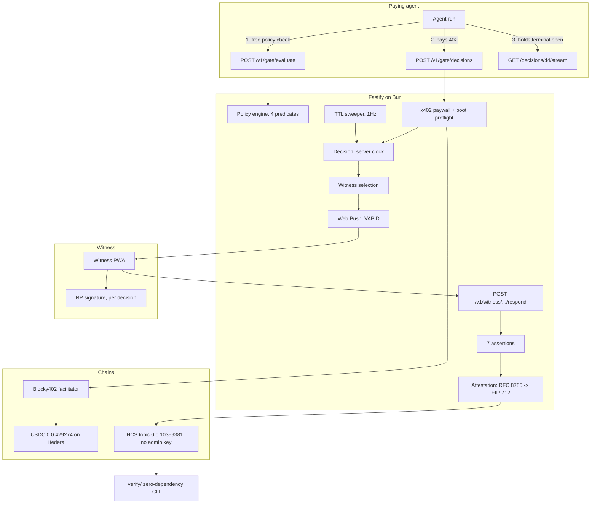

<div align="center">

# PROCTOR

**An AI agent stops mid-payment and pays a live, verified human for permission to continue.**

<br />


<br />

An AI agent hits a policy threshold and is stopped by an HTTP 402. It pays $0.42 in USDC on Hedera to open a decision. A human witness who is **not the operator** proves liveness with World ID, bound to the hash of that exact decision, and approves or refuses inside 60 seconds. The default is refuse. An attestation binding the decision hash, the liveness proof, the witness nullifier and a consensus timestamp lands on a Hedera Consensus Service topic **with no admin key**.

**The product is the evidence, not the approval.**

Built for **ETHOnline 2026**. Partners: **Hedera** (AI & Agentic Payments, Improve the Harness), **World** (Selfie Check), **Arc** (Best Agentic Economy with Circle Agent Stack).

</div>

---

## The problem, the solution, the stack

### The problem

Every AI agent framework already ships a human-approval interrupt. LangGraph has `interrupt`, Temporal has signals, OpenAI has `needsApproval`. They are free, already integrated, and they all produce the same artefact:

```
approved_by: user_44, 14:22:07
```

That row is written by the system being audited. It is editable by the party being audited. And it contains **no evidence that a human, rather than the agent's own service account, produced it**.

Since **2 August 2026**, the EU AI Act's obligations bind deployed high-risk systems. Article 12(3)(d) requires *"the identification of the natural persons involved in the verification of the results"*, and Article 14(4) requires that such systems be *"effectively overseen by natural persons"* who can *"interrupt the system"*. Both bind every high-risk deployer.

Article 14(5) goes further and requires *"at least **two natural persons**"* — but read its opening clause: *"For high-risk AI systems referred to in point 1(a) of Annex III"*, which is **remote biometric identification**. A supplier-payment agent is not that, so 14(5) does not bind this example deployer. We build to it anyway, because it is the strictest oversight bar the Act names and the evidence is identical either way. [The scope is set out in full here.](docs/regulatory-mapping.md)

A self-written, self-editable log satisfies neither.

### The solution

Proctor binds four things a self-hosted approve button cannot:

1. **The decision hash** — the witness's liveness proof is cryptographically bound to *this* decision via the World `signal`, not to "a human approved something at some point"
2. **A liveness proof issued by a party that is not the deployer** — World ID
3. **A nullifier proving the approver is not the operator** — two distinct accounts, checkable by a third party rather than asserted
4. **A consensus timestamp on a log with no admin key** — a clock the deployer did not choose, on a record nobody can rewrite, **including us**

Any third party verifies the whole record offline, against Hedera's mirror node and World's own verifier, **without trusting Proctor**.

### Why this stack

- **Hedera Consensus Service** gives an ordered, tamper-evident log at a fixed sub-cent fee, independently re-derivable through the running hash chain. A contract write costs more, has no better timestamp, and gives up the chain property.
- **x402** lets an agent pay for a resource mid-request, over HTTP, with no account and no prior relationship. The gate is a paywall the agent hits, not an integration it planned for.
- **World ID** proves liveness in seconds on a phone the witness already owns, which is the only reason a human oversight step can be measured in seconds instead of minutes. Selfie Check is the credential we designed for, and World granted the beta flag on 2026-09-09 for the duration of the event, so it is what runs. Exactly what has and has not been demonstrated end to end is [stated below](#what-is-real-vs-staged).
- **Circle** makes a sub-dollar payment to a human economically possible at all.

---

## Try it in 60 seconds

No wallet, no API keys, no feature flags. This runs the entire oversight loop:

```bash
cd backend
cp .env.example .env          # DATABASE_URL is the only value you must edit
bun install
bun run db:push
bun run seed && bun run demo
bun run doctor                # what is live, and what each gap costs you
bun run acceptance            # exercise every claim against the running service
```

**Unconfigured, this runs the full loop and produces a record that is deliberately
NOT independently verifiable** — it is signed with a published demo key and never
reaches a topic. `bun run demo` says so in its own closing line, and `bun run doctor`
lists exactly what is missing. The difference between "it ran" and "it produced
evidence" is the entire product, so the tooling refuses to blur it.

```
1. agent proposes: EUR 41200.00 -> Meridian Logistics
2. policy        : ESCALATE (amount_threshold)
3. decision      : cmtmkf18b0000lxw8lqurjc31
   human line    : Release EUR 41,200 to Meridian Logistics?
   signal        : 0x5b068ce449934ca1df15f5f4…
4. dispatched to the rota, 60s deadline running
5. proof         : VERIFIED
   signal matched this decision, and the witness is not the operator
6. APPROVED in 28 ms
7. attestation   : 722 bytes, ind=crypto
   signed by     : 0xB73837E8C34E2897debeAca0898Da23B52a6Eb10

   The agent is released. The evidence is independently verifiable.
```

And the outcome an auditor actually cares about:

```bash
bun run demo refuse
```

```
5. witness REFUSED. No proof required: refuse is the default outcome.
6. attestation   : 628 bytes, wid=null, wa=token

   The agent is NOT released.
```

### Verify our live evidence log, without installing anything

```bash
bun verify/bin/verify.ts --topic 0.0.10390147
```

```
PASS  25 messages, chain intact from genesis.
      No message was inserted, removed, reordered, or altered.

PASS  completeness: issuance numbers dense across 1 issuer(s).
      No decision was withheld from this log.
```

**Two checks, two different claims.** The first proves nothing was altered. The second
proves nothing was *withheld* — an operator who never submits a record breaks no hash.

**Zero dependencies.** `node:crypto` only. It contacts Hedera's public mirror node and nothing of ours.

---

## Verify it yourself in two minutes

Every row is a link to a file range or a public explorer. Nothing here asks you to take our word.

| Claim | Verify here |
|---|---|
| Evidence topic exists with **no admin key** | [HashScan `0.0.10390147`](https://hashscan.io/testnet/topic/0.0.10390147) |
| The running hash chain verifies offline, from genesis | `bun verify/bin/verify.ts --topic 0.0.10390147` |
| …and the implementation is dependency-free | [`verify/package.json`](verify/package.json) — empty `dependencies` |
| The Java-framing footgun is real, not folklore | [`verify/src/runningHash.ts:56-62`](verify/src/runningHash.ts) + the failing-naive test in [`verify/test/runningHash.test.ts`](verify/test/runningHash.test.ts) |
| Tampering is detected, naming the sequence number | [`docs/hashscan-links.md`](docs/hashscan-links.md) |
| The gate settles through **Blocky402** | `extra.feePayer: 0.0.7162784` in the live 402, [`docs/hashscan-links.md`](docs/hashscan-links.md) |
| The boot preflight stops a dead facilitator taking Hedera down | [`backend/src/lib/x402/server.ts:63`](backend/src/lib/x402/server.ts) |
| A proof for another decision is rejected | [`backend/src/lib/world/verify.ts:104`](backend/src/lib/world/verify.ts) |
| The operator cannot approve their own agent | [`backend/src/lib/world/verify.ts:123`](backend/src/lib/world/verify.ts) |
| Second 61 is a hard refuse, arbitrated by Postgres | [`backend/src/lib/decision/lifecycle.ts:114`](backend/src/lib/decision/lifecycle.ts) |
| Canonicalisation is RFC 8785, recursive at every depth | [`backend/src/lib/attestation/canonical.ts:37`](backend/src/lib/attestation/canonical.ts) |
| Independence is **derived**, never asserted | [`backend/src/lib/attestation/build.ts:179`](backend/src/lib/attestation/build.ts) |
| A decision withheld before submission is detected offline | [`verify/src/completeness.ts`](verify/src/completeness.ts) + `bun verify/bin/verify.ts --topic <id>` |
| Issuance numbers cannot be burned by a failed create | [`backend/src/lib/decision/issue.ts`](backend/src/lib/decision/issue.ts) — counter and create share one transaction |
| Test fixtures cannot reach the immutable evidence topic | `Org.attestable` defaults to **false**; orgs opt in |
| Every 402 carries an EIP-712 offer we cannot later reprice | decode the `payment-required` header |
| HCS-14 UAID matches a fixed test vector | [`backend/src/lib/attestation/uaid.ts:77`](backend/src/lib/attestation/uaid.ts) |
| The export cites the Act provisions it speaks to | [`backend/src/lib/evidence/export.ts:110`](backend/src/lib/evidence/export.ts) |

---

## Live proof

### The evidence log is on Hedera testnet

```
Topic:        0.0.10359381
Memo:         Proctor oversight evidence log v1
Admin key:    NONE  (immutable and undeletable, by anyone, including us)
Submit key:   ECDSA, operator-held
Creation tx:  0.0.10349667@1788500920.243958466
```

Per Hedera's documentation: *"if no adminKey is specified the topic is immutable."*

**Be honest about what the submit key does not buy.** We hold it, so we can still write a *false* entry. What HCS prevents is us **retroactively editing or deleting** what we already wrote, and it binds every entry to a timestamp we did not choose. Combined with a liveness proof and a nullifier issued by parties that are not the deployer, the composite is what a Postgres table cannot give.

### The records on it

| Seq | Outcome | Bytes | `wid` | `ind` |
|---|---|---|---|---|
| 1 | APPROVE | 702 | present | crypto |
| 2 | REFUSE | 621 | **null** | policy |
| 3 | EXPIRE | 619 | **null** | policy |
| 4 | APPROVE | 702 | present | crypto |

All under the 1024-byte single-chunk ceiling, so each is one sequence number and one consensus timestamp.

`wid: null` on a refusal is **correct, not missing**: refuse is the default outcome and requires no proof. Requiring a liveness proof to press a stop button would put a failure mode between a person and a brake pedal.

### Tamper detection, run against that exact topic

| Attack | Result |
|---|---|
| One bit flipped in sequence 4 | `FAIL at seq 4 (running hash mismatch)` |
| **The refusal at sequence 2 deleted** | `FAIL at seq 3 (sequence gap: expected 2, got 3)` |

The second row is the product in one line: **an inconvenient refusal cannot be quietly removed.**

### The gate settles through Blocky402

Hedera's qualification bullet names one facilitator. `extra.feePayer` is injected by the library from that facilitator's own `/supported` response, so it identifies the settling facilitator **as a fact rather than a claim**:

```json
{
  "x402Version": 2,
  "accepts": [{
    "scheme": "exact",
    "network": "hedera:testnet",
    "amount": "420000",
    "asset": "0.0.429274",
    "payTo": "0.0.10349677",
    "maxTimeoutSeconds": 180,
    "extra": { "feePayer": "0.0.7162784" }
  }]
}
```

| Field | Origin |
|---|---|
| `extra.feePayer` `0.0.7162784` | **Blocky402's** fee payer. `x402.org` would show `0.0.9185802` |
| `amount` `420000` | library converted `price: "$0.42"`; no hand-rolled decimal maths |
| `asset` `0.0.429274` | resolved by `ExactHederaScheme`. USDC on Hedera is an **HTS token**, so every settlement moves HTS |

### Accounts

| Role | Account | Type |
|---|---|---|
| Operator (writes attestations) | [`0.0.10349667`](https://hashscan.io/testnet/account/0.0.10349667) | ECDSA secp256k1 |
| Treasury (`payTo`) | [`0.0.10349677`](https://hashscan.io/testnet/account/0.0.10349677) | ECDSA secp256k1 |
| Agent (pays the gate) | [`0.0.10359475`](https://hashscan.io/testnet/account/0.0.10359475) | ECDSA secp256k1 |

### Agent identity, HCS-14 (draft)

```
uaid:aid:9373hj8Dco351vuqrK3p4veDXreeN6848f5A2qQKBdQK4Azmi2BL7UB7rA3Fwiq4KU;uid=0;registry=proctor;proto=x402;nativeId=hedera:testnet:0.0.10349677
```

---

## Sponsor integration in detail

### Hedera (primary)

| Building block | What it is | How Proctor uses it | Product moment |
|---|---|---|---|
| **Hedera Consensus Service** | Ordered, tamper-evident message log with network-assigned timestamps | The evidence substrate. Every resolved decision writes one attestation under 1024 bytes, so it is one chunk with one sequence number and one consensus timestamp. [`backend/src/lib/hedera/hcs.ts`](backend/src/lib/hedera/hcs.ts) | An auditor reads a record whose timestamp the deployer did not choose |
| **Topic with no admin key** | Immutable, undeletable topic | Created once with a submit key and deliberately no admin key. Nobody can update or delete it, including us. Irreversible: the memo can never change | "We cannot delete this even if we wanted to" is checkable on HashScan |
| **Running hash chain (SHA-384)** | Each message commits to the previous hash, payer, topic, timestamp, sequence number and message digest | Recomputed offline in [`verify/src/runningHash.ts`](verify/src/runningHash.ts) to prove no message was inserted, removed, reordered or altered, **with zero trust in the mirror node** | `bun verify --topic 0.0.10359381` prints PASS, and FAIL on one edited character |
| **x402 v2, `exact` scheme** | Pay-per-request over HTTP 402 | The gate. An unpaid `POST /v1/gate/decisions` returns 402 with the requirements in a base64 `payment-required` header. [`backend/src/lib/x402/server.ts`](backend/src/lib/x402/server.ts) | The agent stops mid-run and pays, with no prior account |
| **Blocky402 facilitator** | Hedera-native x402 facilitator | The **default**, not a fallback, because Hedera's qualification bullet names it. Its fee payer appears in every 402 we issue | Provable from the wire, not from our prose |
| **HTS** | Hedera Token Service | USDC `0.0.429274` is an HTS token, so every gate and meter payment moves HTS through the settlement path | Claimed correctly, built for zero cost |
| **HCS-14 (draft)** | Universal agent identifier | Generated per the draft spec: six canonical fields, SHA-384, Base58. No SDK dependency, because a draft standard on a pre-1.0 SDK must not break the evidence writer. [`backend/src/lib/attestation/uaid.ts`](backend/src/lib/attestation/uaid.ts) | Fixed test vector so any reader reproduces the string |
| **Mirror node** | Public read API | Confirms each attestation and supplies the raw rows the offline verifier recomputes. Postgres is the index; **HCS is the truth** | Every console row carries the sequence number needed to re-verify independently |

#### The hard part, and it is our best story

The consensus protobuf documents twelve inputs to the SHA-384 running-hash digest. **Hashing those twelve fields concatenated raw produces a hash that never matches, with no diagnostic.**

The consensus node serialises them through a Java `ObjectOutputStream`, so the bytes actually hashed include the stream header, a class descriptor for `byte[]`, block-data records around the primitives, and a back-reference for the second `byte[]`. Reproduced byte for byte in [`verify/src/runningHash.ts:56-62`](verify/src/runningHash.ts).

Verified against live testnet topic `0.0.4320226`, 45 messages from genesis:

```
mirror node says : c91842fa5e802cc4ac04cf8dd3a5f6b2
naive (doc list) : 509d029eaf6b862d2f96cfb917943f82  <- WRONG
framed (ours)    : c91842fa5e802cc4ac04cf8dd3a5f6b2  <- MATCH
```

The test suite asserts **both** directions: that the framed version reproduces consensus, and that the naive one does not. Nothing in the Hedera tooling ecosystem currently ships this.

#### Trade-offs we accepted for Hedera

- **HCS instead of a contract for attestations.** Rejected on-chain per-decision records because HCS is $0.0008 per message with a network-assigned timestamp and a running hash chain; a contract write costs more, has no better timestamp, and **gives up the chain property**. Trade-off: no on-chain queryability of individual records. We accept that because the export plus the mirror node covers it.
- **Zero Solidity, entirely.** Rejected `OversightLog.sol` because nothing on the critical path needs it and no prize bullet requires it. Enrolment records and trust roots go to HCS, where the consensus timestamp cannot be backdated any more than a contract event can. Trade-off: no deployed contract to point at.
- **A submit key.** Rejected an open topic because any account could then append to our evidence log and an auditor could not distinguish a genuine attestation from an attacker's. Trade-off: we hold the key, so we can write a false entry. Stated plainly above rather than hidden.
- **Blocky402 as the default facilitator.** Rejected `x402.org` as primary because the qualification bullet names Blocky402 with no "or equivalent". Trade-off: a third-party dependency with no published SLA, mitigated by the boot preflight below.

### World ID (Selfie Check)

| Component | What it is | How Proctor uses it | Product moment |
|---|---|---|---|
| **`signal` binding** | Application-supplied value hashed into the proof | **The mechanism the entire product rests on.** The decision hash is the `signal`, so a liveness proof is bound to *this* decision and cannot be replayed against another. [`backend/src/lib/world/verify.ts:104`](backend/src/lib/world/verify.ts) | Without it, any liveness proof satisfies any decision and Proctor is a paid captcha |
| **Nullifier comparison** | RP-scoped pseudonymous identifier | The witness nullifier is compared against the operator's, as bigint so hex casing cannot smuggle a match past. This is the Article 14(5) "two natural persons" evidence | The operator cannot approve their own agent |
| **RP signature (v4)** | Mandatory backend signature before the widget opens | ES256 over the RP payload, minted **per decision** rather than on page load, with a single-use nonce persisted. [`backend/src/lib/world/rp.ts`](backend/src/lib/world/rp.ts) | New in 4.0 and the single biggest schedule risk on this leg; it works |
| **Selfie Check** | Medium-assurance liveness credential | Treated as an **abuse-prevention and eligibility** signal, behind one variable so the swap is a one-line change | It is what stops the approval being satisfied by the agent's own service account |

#### What we claim, and what we do not

> Proctor treats Selfie Check as an **abuse-prevention** signal, not an identity signal: it is what stops the approval step from being satisfied by the agent's own service account, which is the exact failure mode that makes today's human-oversight logs worthless to an auditor.

> **We do not claim Selfie Check proves one-person-one-account.** It proves liveness and facial continuity. Our claim is narrower and sufficient: the approver was a live human, and their World ID account is cryptographically distinct from the operator's. Independence between the two *humans* is a policy property of the rota, and every attestation records which of the two it carries in an explicit `ind` field.

| Property | Established by | Strength |
|---|---|---|
| A live human approved | Selfie Check | **cryptographic** |
| They approved **this** decision | decision hash as `signal` | **cryptographic** |
| Their account differs from the operator's | nullifier comparison | **cryptographic**, v3 credentials only |
| They are a different **person** | the rota, an org policy | **policy** |
| The record was not altered afterwards | HCS running hash, no admin key | **cryptographic** |

**Two distinct nullifiers do not prove two humans.** One person can hold two World ID accounts. `classifyIndependence` **derives** `ind` rather than asserting it, and degrades to `policy` on any credential whose nullifier is one-time-use.

#### The finding that decides our fallback

World's own docs contradict each other, and the answer changes an integrator's design:

- `idkit/integrate`: *"The same person verifying the same action always produces the same nullifier."*
- `4-0-migration`: *"In 4.0, nullifiers are one-time-use, and `session_id` is the stable link across requests."*

The migration guide is newer and version-qualified, so it is the correction. **The operator-independence check is meaningful on a World ID 3.0 credential and silently meaningless on a v4 uniqueness proof**, where two proofs from the *same* account produce different nullifiers and `witness !== operator` passes trivially.

That is why `hasStableNullifier()` exists, and why a test asserts `hasStableNullifier('ORB_PRESENCE') === false`. If we are ever forced onto the v4 path, the test suite itself records that the property degraded.

Full write-up, with eleven dated and reproducible items across all five required sections: **[`WORLD_FEEDBACK.md`](WORLD_FEEDBACK.md)**.

#### Trade-offs we accepted for World

- **Selfie Check over `proofOfHuman`.** Rejected the v4 uniqueness path because its one-time-use nullifier makes our core security property silently false. Trade-off: Selfie Check is a gated beta, so we build behind one variable and ship the compatible preset if the flag does not arrive.
- **A refusal requires no proof.** Rejected symmetric proof requirements because making a human prove liveness to press a stop button puts a failure mode between a person and a brake pedal. Trade-off: a refusal is authenticated by bearer token alone, so every attestation carries `wa: "proof" | "token"` to say so rather than overstate.
- **Server-side verification only.** Selfie Check proofs cannot be verified on-chain on any chain, and there is no World ID deployment on Hedera at all. We attest a backend-verified **outcome** and publish the raw proof so a third party re-verifies against **World**, not against us.

### Arc / Circle

| Component | How Proctor uses it | Status |
|---|---|---|
| **Per-second meter** | The witness is billed for real seconds of human attention, streamed to the agent at 4Hz over SSE. A single $0.42 payout does not need Nanopayments; a per-second meter does | Meter live, settlement pending USDC |
| **Circle Wallets** | Witnesses are paid into developer-controlled wallets they never signed up for | Designed, not yet settled |
| **Why Paymaster is absent** | Circle Paymaster has no Arc support, and on Arc gas is already USDC, so it is structurally redundant | Stated rather than silent |

**Honest scope: Arc is the least-developed leg.** The meter runs and is visible on camera; the settlement path is blocked on testnet USDC, not on code.

---

## The nine lines that save the demo

Tested with a facilitator unreachable. It does **not** degrade gracefully — it takes the **whole route down, including entries a healthy facilitator serves**, returning a bare 500 on every request.

The trap has four steps: `initialize()` swallows the dead facilitator and resolves cleanly, `paymentMiddleware()` also succeeds because it validates lazily, the real validation throws `RouteConfigurationError` **asynchronously**, and that rejection is **not caught by `app.setErrorHandler`**. Boot looks healthy. Every request fails.

```ts
await server.initialize();
const accepts = desired.filter((o) => {
  const ok = !!server.getSupportedKind(2, o.network, o.scheme);
  if (!ok) console.warn(`DROPPED accepts entry: ${o.scheme} on ${o.network}`);
  return ok;
});
if (accepts.length === 0) throw new Error('no_payment_option_available');
paymentMiddleware(app, { 'POST /v1/gate/decisions': { accepts } }, server);
```

Verified against the real scenario, not a synthetic one: asking Blocky402 for Hedera **and** Arc drops Arc and keeps Hedera payable.

```
[x402] DROPPED accepts entry: exact on eip155:5042002 (no facilitator support)
[x402] 1 payment option(s) live: hedera:testnet
```

This converts *"Circle is down so nothing works"* into *"Circle is down so the demo runs on Hedera only"*, decided automatically at boot. [`backend/src/lib/x402/server.ts:63`](backend/src/lib/x402/server.ts)

---

## Architecture



**Postgres is the index. HCS is the truth.** The mirror node cannot filter on anything inside a message payload, so every console query is served from Postgres and **every row carries the sequence number and consensus timestamp** needed to re-fetch and re-verify independently.

---

## Repo layout

| Path | What it is |
|---|---|
| [`backend/`](backend/) | Fastify 5 on Bun. The gate, the policy engine, the witness flow, the attestation builder, the evidence API |
| [`verify/`](verify/) | **Zero-dependency** offline verifier. `node:crypto` only, because the claim is only as strong as this dependency list |
| [`agent/`](agent/) | The paying agent. Stops on a 402, pays, proceeds |
| [`web/`](web/) | Console and witness PWA (in progress) |
| [`docs/`](docs/) | Build plan, regulatory mapping, agent discovery, verifiable artefacts |

---

## What each test file proves

**128 tests, 717 assertions**, across backend and verifier.

- **Evidence integrity**: `verify/test/runningHash.test.ts` — chain reproduction from genesis, one flipped bit, removed message, reorder, forged insert, backdated timestamp, **and that the naive implementation is wrong**
- **Canonicalisation**: `canonical.test.ts` — RFC 8785 conformance, nested-object sorting at every depth, arrays-are-data, **and a direct test of the broken naive canonicaliser**
- **World verification**: `worldVerify.test.ts` — all seven assertions, a proof for another decision rejected, a missing `signal_hash` rejected rather than read as a pass, hex-casing operator match
- **Fail-closed lifecycle**: `lifecycle.test.ts` — approve vs sweep raced 50 times in **both** directions: sweeper always wins when overdue, approver always wins when valid, invariant holds at the knife edge
- **Attestation**: `attestation.test.ts` — EIP-712 verifies, tamper invalidates, size assertion fires, refusal semantics, independence derived not asserted
- **The gate**: `x402Gate.test.ts` — Blocky402 advertises Hedera, unsupported network dropped rather than fatal, refuses to boot when nothing is payable
- **Witness flow**: `witnessFlow.test.ts` — end-to-end against the real database, operator cannot approve, cross-decision proof rejected
- **Standards**: `uaid.test.ts` (HCS-14, numeric skill sort, fixed vector), `a2a.test.ts` (exactly one interrupted state), `sse.test.ts` (WHATWG wire format, integer meter arithmetic)

```bash
cd backend && bun test     # 120 pass
cd verify  && bun test     #   8 pass
```

---

## Docs-first discipline

Every non-trivial decision in this repo was made against the primary source, not from memory. Where a doc was wrong, we say so.

| Spec read | What it changed |
|---|---|
| **RFC 8785 (JCS)** | We use the standard rather than a bespoke canonicalisation, so a third party can re-derive every hash with any off-the-shelf JCS library. Verified JS natively satisfies it |
| **RFC 8292 (VAPID)** | ES256 on P-256, `exp` capped at 24h. Push TTL is set to the remaining decision deadline, because a notification arriving after expiry is worse than none |
| **WHATWG SSE** | An event is dispatched by a **blank line**; miss it and the terminal looks hung. `x-accel-buffering: no`, because nginx would otherwise hold the whole countdown |
| **PostgreSQL transaction isolation** | Under READ COMMITTED the `WHERE` clause is **re-evaluated** after blocking, so a conditional `updateMany` is a correct arbiter. No transactions, no `SELECT FOR UPDATE`, no Redis |
| **EU AI Act Art. 12 and 14** | Art 14(5)'s "**two natural persons**" is a far stronger hook than "demonstrate oversight", and it justifies recording both nullifiers. [`docs/regulatory-mapping.md`](docs/regulatory-mapping.md) |
| **Hedera consensus protobuf** | The documented field list is necessary but **not sufficient**; the Java framing is the difference between a verifier that works and one that never matches |
| **A2A specification** | `TASK_STATE_AUTH_REQUIRED` is "an interrupted state", which is one-to-one with a dispatched decision |

### Obstacles we hit, one per sponsor

- **Hedera:** the running hash is SHA-384 over **Java-serialization-framed** bytes, not the documented field list. Also, `@hiero-ledger/sdk@2.85.0` does not surface `topicRunningHashVersion` even though the protobuf defines it, so `confirmAttestation` reads the version from the mirror node and reports a mismatch rather than guessing.
- **World:** the docs contradict themselves on nullifier stability, and the answer decides whether our core security property is real. Separately, iOS Sandbox enrollment silently requires an **email-based Portal account**, a requirement that appears on no docs page and returns zero search results.
- **Circle / x402:** `createClientHederaSigner` documents `network` as *"defaults to testnet"*, which reads as though the short form is accepted. Passing `'testnet'` throws `Unsupported Hedera network: testnet`; it requires the CAIP-2 form.

---

## What is real vs staged

Honest checklist. Everything marked Verified is checkable from this repo today.

| Item | Status | Evidence |
|---|:---:|---|
| HCS evidence topic, no admin key | **Verified** | [Topic `0.0.10359381`](https://hashscan.io/testnet/topic/0.0.10359381) |
| Running hash chain verifies offline from genesis | **Verified** | `bun verify/bin/verify.ts --topic 0.0.10359381` → PASS |
| Verifier has zero dependencies | **Verified** | [`verify/package.json`](verify/package.json) |
| Tamper detection, five vectors | **Verified** | [`docs/hashscan-links.md`](docs/hashscan-links.md) |
| Live 402 settling through Blocky402 | **Verified** | `extra.feePayer: 0.0.7162784` on the wire |
| Boot preflight drops a dead facilitator | **Verified** | `x402Gate.test.ts`, real Blocky402 + Arc scenario |
| Fail-closed TTL, race-tested both directions | **Verified** | `lifecycle.test.ts`, 50 rounds |
| World RP signing against the real key | **Verified** | `worldVerify.test.ts`, 65-byte EIP-191 sig |
| Seven verification assertions | **Verified** | `worldVerify.test.ts` |
| Attestations for approve, refuse, expire | **Verified** | seq 1–4 on the live topic |
| HCS-14 UAID, fixed vector | **Verified** | `uaid.test.ts` snapshot |
| A2A agent card + TaskState mapping | **Verified** | `GET /.well-known/agent-card.json` |
| SSE meter and countdown | **Verified** | live frames at 4Hz, `sse.test.ts` |
| **One real paid request end to end** | **Blocked** | Agent built and signing; Circle's Hedera faucet has not delivered testnet USDC. Fails at `invalid_exact_hedera_payload_preflight_failed`, which is precisely "payer holds no USDC" |
| **Selfie Check credential** | **Blocked** | Access requested 2026-09-02; running on `WORLD_MODE=DEVICE` until the flag lands. The swap is one variable |
| Witness PWA | **In progress** | Backend routes complete and tested; `web/` frontend pending |
| Arc / Circle settlement | **Not shipped** | Meter runs; payout path designed, not settled |
| Mainnet | **Not shipped** | Hedera testnet only |

---

## Explicitly out of scope

Named so nobody wonders whether we forgot.

- **Any Solidity.** Nothing on the critical path needs a contract, and no prize bullet requires one.
- **A witness marketplace.** The word is **rota**. Witnesses hold an org-issued role. Nobody lets an anonymous stranger approve EUR 41,200, and Proctor does not propose that they should.
- **On-chain verification of any World proof.** Impossible for Selfie Check on any chain, and there is no World ID deployment on Hedera at all.
- **Building on `@worldcoin/human-in-the-loop`.** See prior art below. Referencing it precisely is worth more than using it.
- **ERC-8004, UCP, custom HTS fee schedules.** Each is strictly worse than a point we already have. ERC-8004 in particular is 5–8 hours for a weaker version of what HCS-14 gives in 1–2.
- **A generic policy language.** Four predicates. Anything more is a product, not a demo.
- **Redis, queues, workers.** One Fastify process, one Postgres, one conditional UPDATE. The architecture is correct under concurrency without them.

---

## Prior art, named first

**World ships [`@worldcoin/human-in-the-loop`](https://docs.world.org/agents/human-in-the-loop/integrate)**: *"Add human approval workflows to AI agents using World ID."* An AI agent pauses mid-execution and waits for a real, verified human to approve. **Same control flow, shipped by the sponsor.** We are not pretending otherwise.

What Proctor adds:

1. The approver is a **cryptographically distinct account** from the operator
2. The approval is a **liveness proof** bound to the decision hash, not a static credential
3. The output is an **externally ordered evidence record**, not a resumed function call
4. The witness **gets paid**, which is what makes the oversight real rather than theatre

Their default preset carries no liveness. We did not build on it because it drags in the Workflow SDK and the Vercel AI SDK, assumes a chat workflow, and has no hook for the payment leg, the HCS write, or the nullifier comparison.

Other neighbours: **World AgentKit** proves an agent *has* an owner — a registration-time badge, where Proctor proves a person looked at *this* transaction at *this* second. **LangGraph `interrupt`, Temporal signals, OpenAI `needsApproval`** are unpaid, un-attested internal callbacks that produce exactly the editable row this project exists to replace.

---

## The counterargument, and the answer

> This is a paid captcha. Every agent framework already ships a human-approval interrupt, all free, all already integrated. You took a solved control-flow problem, made it cost money, made it slower, made it depend on a beta biometric credential, and called the added latency a compliance feature.

**Correct about the approval. Wrong about the product.**

Every system it names produces the same artefact: a row written by the system being audited, editable by the party being audited, containing no evidence that a human rather than a service account produced it. Under Articles 12 and 14 the deployer must *demonstrate* oversight. A self-written, self-editable log is exactly what an auditor discounts, which is why independent attestation exists as a paid category at all.

Proctor's output binds four things a self-hosted button cannot, and that composite is **not producible inside the trust boundary being audited** — for the same reason a company cannot audit itself.

On "you made it cost money": that is the point. Human oversight is theatre today because clicking is free, so it gets delegated to whoever is cheapest and eventually to a script. **Attaching a price and a face is what makes the oversight real**, which is why the payment leg is load-bearing rather than decorative.

---

## Run locally

| Tool | Version | Purpose |
|---|---|---|
| Bun | 1.2+ | Runtime |
| PostgreSQL | 15+ | The index (HCS is the truth) |
| Node | 18+ | Verifier only, if not using Bun |

```bash
# 1. Backend
cd backend
cp .env.example .env          # DATABASE_URL is the only required value to start
bun install
bun run db:push
bun run seed
bun run demo                  # the whole loop, no wallet needed
bun dev                       # http://localhost:3700

# 2. Verify our live evidence log, from anywhere
bun verify/bin/verify.ts --topic 0.0.10359381

# 3. Tests
cd backend && bun test        # 120 pass
cd verify  && bun test        #   8 pass
```

Optional, for the live chain paths: `HEDERA_OPERATOR_ID`, `HEDERA_OPERATOR_KEY`, `WORLD_RP_SIGNING_KEY`. Each leg warns and disables itself when its key is absent, rather than crashing.

---

## Submission

| Field | Value |
|---|---|
| Event | ETHOnline 2026 |
| Tracks | Hedera AI & Agentic Payments · Hedera Improve the Harness · World Selfie Check · Best Agentic Economy with Circle Agent Stack · Launch on Arc Testnet & Push to Mainnet |
| Evidence topic | [`0.0.10359381`](https://hashscan.io/testnet/topic/0.0.10359381) |
| Feedback deliverable | [`WORLD_FEEDBACK.md`](WORLD_FEEDBACK.md) |
| Regulatory mapping | [`docs/regulatory-mapping.md`](docs/regulatory-mapping.md) |

---

## License and disclaimers

MIT.

- **Testnet only.** Every account, topic, transaction and USDC figure in this repo is on Hedera testnet. Do not send mainnet funds to any address here.
- **We do not claim compliance.** Using Proctor does not make a deployer EU AI Act compliant. Compliance is a property of their whole system. Proctor produces one piece of evidence that is otherwise difficult to produce, and is explicit about what that evidence does and does not establish.
- **Selfie Check proves liveness and facial continuity, not uniqueness.** One person can hold two World ID accounts. Every attestation records which property it carries.

<div align="center">

**The product is the evidence, not the approval.**

</div>
